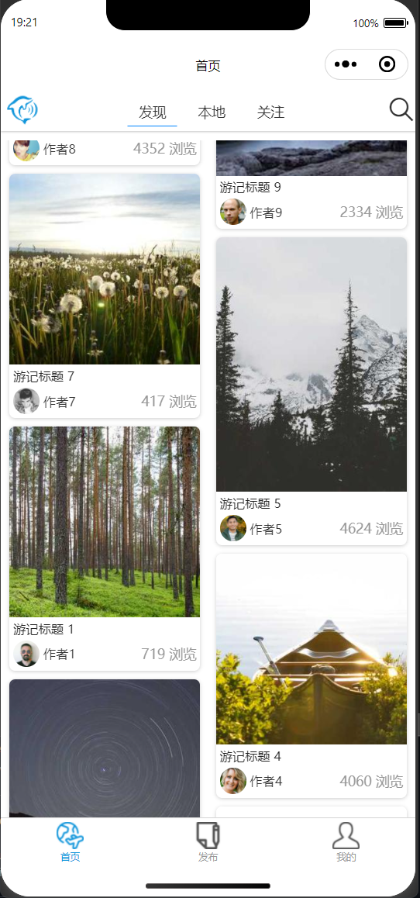
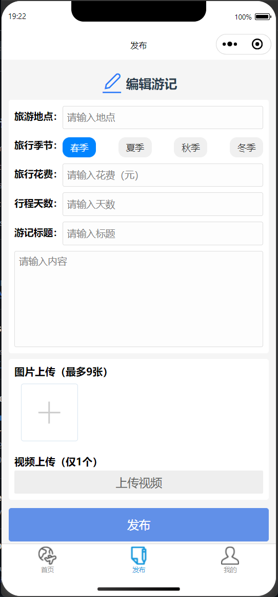
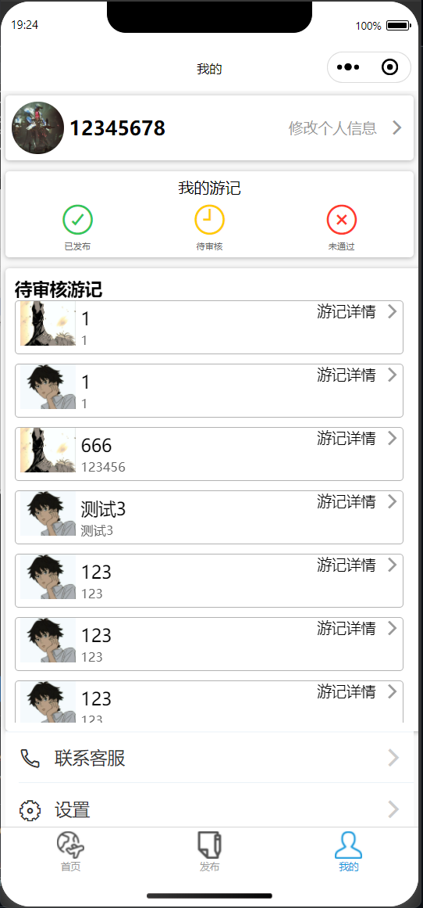
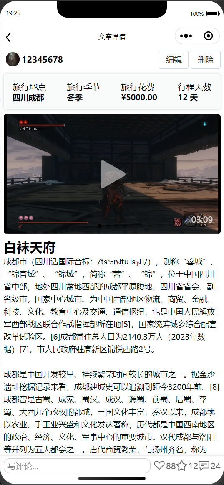
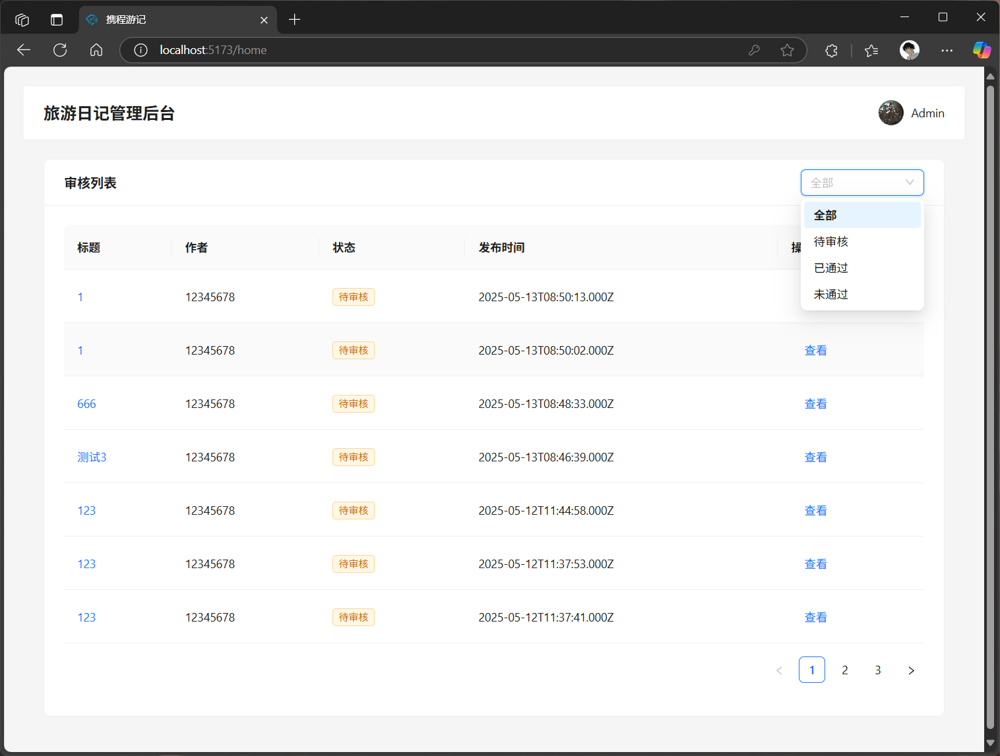
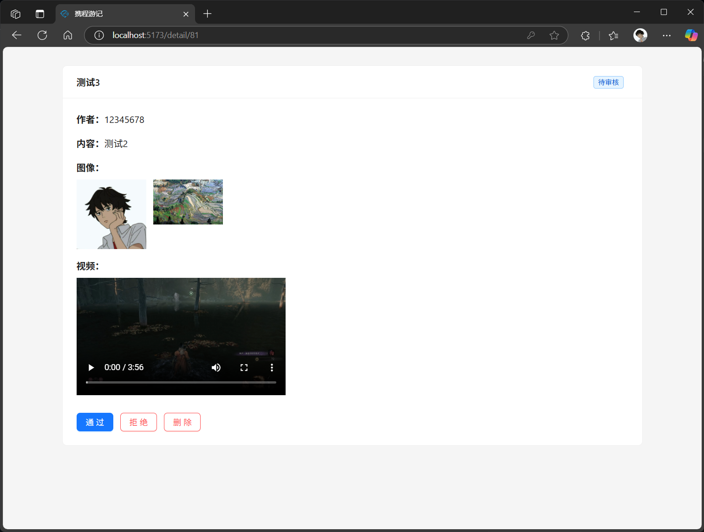

# 携程游记

### 📝 项目介绍

这是一个基于 React + Node.js 实现的旅游日记平台，包含两个系统：

1. **移动端用户系统**：用户可以发布、浏览游记，包括图文、视频内容的上传与展示。
2. **PC端审核系统**：管理员可对用户发布的游记进行审核、通过、拒绝与删除操作。

项目实现了完整的前后端分离架构，致力于提供良好的用户体验和便捷的内容管理。

------

### 👥 成员分工

| 成员           | 负责模块                                                     |
| -------------- | :----------------------------------------------------------- |
| 杨东明（队长） | 后端接口设计与开发（Node.js + Express）+移动端前端开发（Taro + Taro UI）+审核系统前端开发（React + Ant Design） |


------

### 🚀 项目亮点

- ✅ **前后端分离架构**，使用 RESTful API 进行数据交互；
- 📱 **使用Taro开发**微信小程序；
- 📷 **支持多媒体上传与展示**（图片瀑布流 + 视频全屏播放）；
- 🔒 **权限系统与审核流程**，适用于内容平台的管理需求；
- 💡 **性能优化**：实现了瀑布流分页加载避免整体刷新、吸顶吸底元素等。

------

### 🛠 技术栈

- **前端**：
  - 用户系统：Taro、TaroUI、TypeScript
  - 审核系统：React、Ant Design
- **后端**：Node.js、Express、MySQL

------

### ⚙️ 安装与运行方式

#### 后端（Node.js）：

```bash
cd tripnote-backend
npm install
npm run dev
```

若需要使用该后端需要在本地数据创建以下表：

```mysql
-- auto-generated definition
create table user
(
    id         bigint unsigned auto_increment comment '用户ID'
        primary key,
    username   varchar(255)                                      not null,
    nickname   varchar(255)                                      not null,
    avatar     varchar(255)                       default ''     not null,
    password   varchar(255)                                      not null,
    status     int                                default 1      null,
    phone      varchar(255)                                      null,
    email      varchar(255)                                      null,
    role       enum ('user', 'reviewer', 'admin') default 'user' not null comment '用户角色',
    is_deleted tinyint(1)                         default 0      null,
    createdAt  datetime                                          not null,
    updatedAt  datetime                                          not null,
    constraint username
        unique (username)
)
    comment '用户表';
```

```mysql
-- auto-generated definition
create table note
(
    id            bigint auto_increment
        primary key,
    title         varchar(255)                                               not null,
    user_id       bigint unsigned                                            not null comment '作者用户ID',
    image_urls    text                                                       null,
    video_url     varchar(500)                                               null,
    content       text                                                       null,
    view_count    int                                      default 0         null,
    status        enum ('pending', 'approved', 'rejected') default 'pending' null,
    location      varchar(255)                                               null,
    season        enum ('春季', '夏季', '秋季', '冬季')                      null,
    duration_days int                                                        null,
    cost          decimal(10, 2)                                             null,
    is_deleted    tinyint(1)                               default 0         null,
    createdAt     datetime                                                   not null,
    updatedAt     datetime                                                   not null,
    reject_reason varchar(255)                                               null comment '拒绝原因',
    constraint note_ibfk_1
        foreign key (user_id) references user (id)
            on update cascade on delete cascade
);

create index user_id
    on note (user_id);
```

并且需要在tripnote-backend根目录下创建.env文件：

```
DB_HOST=localhost
DB_PORT=3306
DB_USER=数据库账号
DB_PASSWORD=你的数据库密码
DB_NAME=数据库名字
//用于token生成
JWT_SECRET=666
JWT_EXPIRES_IN=7d
```


#### 前端移动端（Taro）：

```bash
cd tripnote-frontend
npm install
npm run dev:weapp
```

#### 前端审核系统（React）：

```bash
cd tripnote-admin-frontend
npm install
npm start
```

------

### 🎥 用户端页面

#### 🏠 用户端首页


#### 📝 发布页面


#### 📒 我的游记页面


#### 📄 游记详情页面


---

### 🧾 审核后台页面

#### 📋 审核列表页面


#### 🔍 审核详情页面

------

### 📂 项目源码地址

- GitHub：https://github.com/MmaoM0225/tripnote

------

### 🧠 技术难点与突破

- 动态瀑布流组件设计（Taro 环境下图片异步加载与分页渲染）；
- 视频上传、预览、全屏播放的兼容处理；
- 审核系统实现快速操作（通过、拒绝、删除）与状态同步
- 部分接口使用token鉴权，防止恶意使用

------

### 📌 总结与收获

通过本项目，我们掌握了从 0 到 1 搭建一个完整前后端应用的流程，深入理解了 Taro 在小程序开发中的优势与限制。
